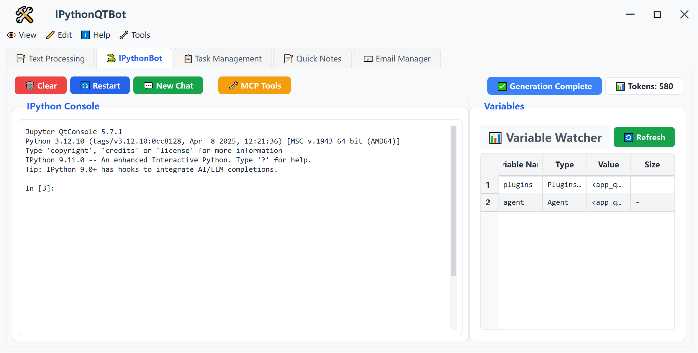

## 📋 Project Overview

**IPythonQTBot-framework** is an intelligent assistant framework based on **PySide6 (Qt for Python)**, integrating **IPython kernel** and **LLM (Large Language Model) Agent** functionality. Users can easily connect to MCP services compatible with CherryStudio format, while using LLM to analyze variables in the IPython kernel, bridging the gap between data processing, note management, and large language models.

---
## 📷 Interface Screenshot



## ✨ Project Advantages

- Easy to deploy with basic Python3 environment knowledge; simple package installation;
- PySide6 local deployment, small window can be dragged around freely, safe and convenient;
- Supports LLM operations on IPython, email, schedule and other built-in components, and supports LLM agent calling any third-party MCP;
- Flexible plugin system:
    - Can develop plugins easily with only Python language, easy to integrate Python functionality;
    - Plugin interface supports automatic MCP exposure;
    - Simple UI+MCP dual-mode operation, seamless communication between humans and AI;

## 🏗️ Project Architecture

```plaintext
IPythonQTBot/
├── app_qt/                    # PySide6 GUI application (main window, tabs, etc.)
├── plugins/                   # Plugin system
│   ├── daily_tasks/          # Daily task management
│   ├── email_utils/          # Email utilities
│   ├── mcp_bridge/           # MCP protocol bridge
│   ├── pandoc_utils/         # Pandoc utilities
│   ├── quick_notes/          # Quick notes feature
│   └── text_helper/          # Text assistant
├── docs/                      # Detailed documentation (21 documentation files)
├── demos/                     # Demo code
├── tests/                     # Test files
└── single_component_tests/    # Single component tests
```

---

## ✨ Core Features

| Feature Module | Description |
|---------|------|
| **🔧 Plugin System** | Flexible plugin architecture, supports dynamic loading/unloading, dependency management |
| **🤖 LLM Agent** | Supports Kimi, OpenAI, Zhipu AI and other large language models |
| **💻 IPython Console** | Embedded Python interactive environment |
| **🔌 MCP Tools Integration** | Supports external service access via MCP protocol |
| **📝 Quick Notes** | Intelligent note management feature |
| **📧 Email Utilities** | Email sending and receiving functionality |

---

## 📦 Main Dependencies

```
PySide6 >= 6.0.0        # GUI framework
pyperclip >= 1.8.0      # Clipboard operations
ipython >= 7.0.0        # Python interactive environment
qtconsole >= 5.0.0      # Qt console
openpyxl >= 3.0.0       # Excel processing
mcp >= 1.26.0           # MCP protocol support
openai >= 1.0.0         # OpenAI API
```

---

## 🚗 Usage Demonstration


---

## 🚀 Startup Instructions

Recommended Python >= 3.12

```bash
# ssh clone
git clone git@gitee.com:mole-h-6011/IPythonQTBot-framework.git

# or: https clone
git clone https://gitee.com/mole-h-6011/IPythonQTBot-framework.git

cd IPythonQTBot-framework

pip install -r requirements.txt 

python run_helper_qt.py
```
---

## 🔑 API Key Configuration and Basic Operations


After configuration is complete:
- Ask question: `agent.ask("your question")`, or `%ask your question`.
    - Special: After setting the inline command to avoid inputting %, you can directly input `ask your question` for Q&A; Set command to `%automagic on`;
- Clear context: `agent.clear()`;
- Show context details: `agent.show_messages()`;
- Show tools: `agent.show_tools()`.

## 📚 Key Features

1. **Plugin Loading** - Supports plugin configuration file (`plugins_list.json`) for managing enabled/disabled state
2. **Magic Commands** - Provides APIs like `%ask` for convenient LLM capability invocation
3. **Multi-Tab Interface** - Main window supports multi-tab layout
4. **API Export** - Plugins can export APIs for LLM Agent invocation
5. **Third-party MCP Tools Integration** - Quick import of MCP tools support, compatible with CherryStudio tool MCP configuration format

## 🧾 Future Plan