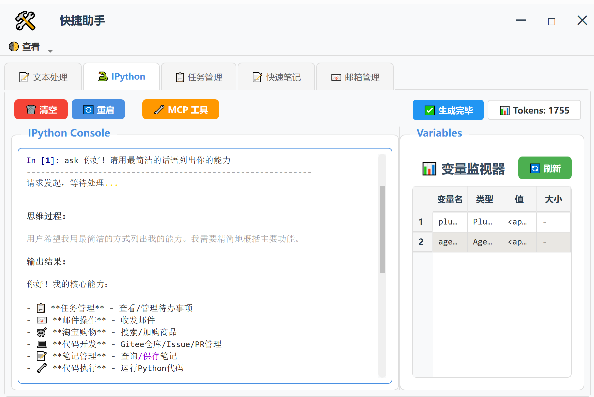
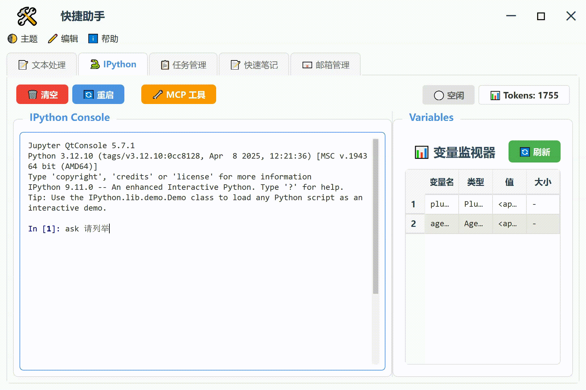
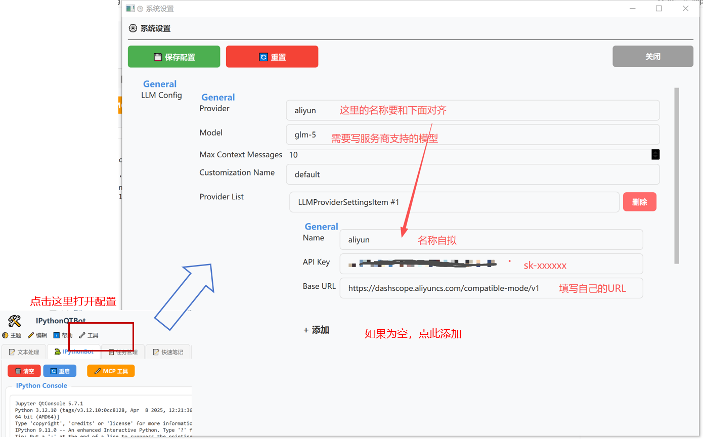

## 📋 项目概览

**IPythonQTBot-framework** 是一个基于 **PySide6 (Qt for Python)** 的智能助手框架，集成了 **IPython 内核** 和 **LLM（大语言模型）Agent** 功能。用户可以很方便的接入MCP, 同时使用LLM对IPython内核中的变量进行分析, 打通数据处理\笔记管理\大模型中间的鸿沟.

同时，本项目具备灵活的插件系统，可简单使用Python编写插件并调用相关功能！

---
## 📷 界面示意图



## ✨ 项目优势

- 会一点Python3环境部署即可运行, 包安装简单;
- PySide本地部署, 小窗口随意拖动操作, 安全便捷;
- 支持大模型操作IPython, 邮件, 日程等内置组件, 并支持大模型agent调用任何第三方MCP
- 具有灵活的插件系统
    - 只需要Python一种语言就能随便开发插件, 便于集成Python功能; 
    - 插件接口支持自动暴露MCP; 
    - 简单粗暴实现UI+MCP双模操作, 人与AI无缝沟通;
    - 支持插件热加载机制，开发调试插件无需编译或单独配置环境，调试极为方便。

## 🏗️ 项目架构

```
IPythonQTBot/
├── app_qt/                    # PySide6 GUI应用（主窗口、标签页等）
├── plugins/                   # 插件系统
│   ├── daily_tasks/          # 日常任务管理
│   ├── email_utils/          # 邮件工具
│   ├── mcp_bridge/           # MCP协议桥接
│   ├── pandoc_utils/         # Pandoc工具
│   ├── quick_notes/          # 快速笔记功能
│   └── text_helper/          # 文本助手
├── docs/                      # 详细文档（21个文档文件）
├── demos/                     # 演示代码
├── tests/                     # 测试文件
└── single_component_tests/    # 单组件测试
```

---

## ✨ 基础功能及MCP扩展功能

| 功能模块 | 描述 |
|---------|------|
| **🔧 插件系统** | 灵活的插件架构，支持动态加载/卸载、依赖管理 |
| **🤖 LLM Agent** | 支持 Kimi、OpenAI、智谱AI 等多种大模型 |
| **💻 IPython控制台** | 嵌入式Python交互环境 |
| **🔌 MCP工具集成** | 支持MCP协议的外部服务接入 |
| **📝 快速笔记** | 智能笔记管理功能 |
| **📧 邮件工具** | 邮件发送和接收功能 |

---

## 📦 主要依赖

```
PySide6 >= 6.0.0        # GUI框架
pyperclip >= 1.8.0      # 剪贴板操作
ipython >= 7.0.0        # Python交互环境
qtconsole >= 5.0.0      # Qt控制台
openpyxl >= 3.0.0       # Excel处理
mcp >= 1.26.0           # MCP协议支持
openai >= 1.0.0         # OpenAI API
```

---

## 🚗使用效果


---

## 🚀 启动方式

建议 Python >= 3.12

```bash
# ssh clone
git clone git@gitee.com:mole-h-6011/IPythonQTBot-framework.git

# 或者: https clone
git clone https://gitee.com/mole-h-6011/IPythonQTBot-framework.git

cd IPythonQTBot-framework

pip install -r requirements.txt 

python run_helper_qt.py
```
---

## 🔑 API Key配置和基本操作



配置完成后, 
- 提问: `agent.ask("你的问题")`, 或者 `%ask 你的问题`. 
    - 特别的,设置了行内命令免输入%后,可以直接输入 `ask 你的问题`进行问答; 设置命令为 `%automagic on`;
- 清除上下文: agent.clear();
- 显示上下文详细信息: agent.show_messages();
- 显示工具: agent.show_tools().

## 📚 特色亮点

1. **插件加载** - 支持插件配置文件 (`plugins_list.json`) 管理启用状态
2. **Magic命令** - 提供 `%ask` 等便捷调用LLM能力的API
3. **多Tab界面** - 主窗口支持多标签页布局
4. **API导出** - 插件可导出API供LLM Agent调用
5. **第三方MCP工具集成** - 快速导入MCP工具支持, 兼容CherryStudio工具的MCP配置格式
6. **插件热加载** - 脚本即插件，调试极方便

## 🧾 开发计划

- 支持动态链接/启用/禁用MCP服务
- 支持动态启用/禁用插件
- 插件重新热加载考虑依赖关系
- 打包为独立应用程序，并支持插件加载