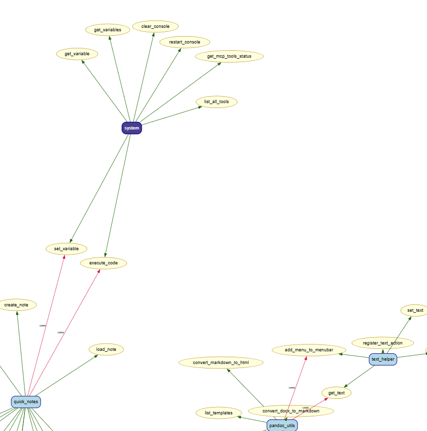
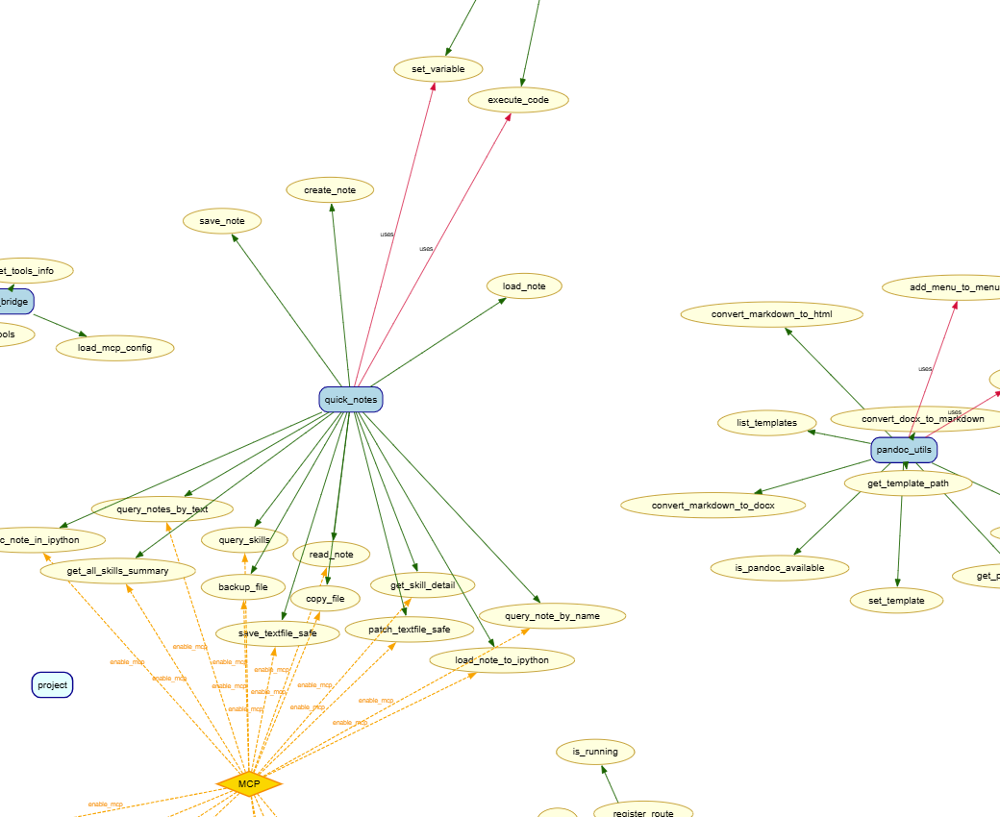

# 插件依赖分析

插件依赖分析可由静态分析进行全自动完成：
### 文本输出命令

#### 1. 分析单个文件夹
python sast/folder_method_analyzer.py --folder ./plugins/mcp_bridge

#### 2. 分析路径下所有文件夹
python sast/folder_method_analyzer.py --path ./plugins

#### 3. 简洁表格输出
python sast/folder_method_analyzer.py --path ./plugins --table

#### 4. JSON 输出
python sast/folder_method_analyzer.py --path ./plugins --json output.json

#### 5. JSON 输出到 stdout
python sast/folder_method_analyzer.py --path ./plugins --json -

## 图结构输出

### 图结构属性
1. 边的属性
- methods: 依赖的方法名称列表
- method_count: 总依赖次数（累加）
- unique_method_count: 去重后的方法数
- label: 用于 DOT 显示（最多3个方法）
penwidth: 根据依赖数动态调整粗细
2. CLI 新参数：
- --dot OUTPUT / -d OUTPUT: 导出 DOT 文件
- --graph-info / -g: 显示依赖图信息
- --min-edge-count N: 过滤低权重边
3. 节点颜色
- 🟢 浅绿色: 普通命名空间
- 🔵 浅蓝色: system 命名空间
- 🔴 浅珊瑚色: 多文件夹共享的命名空间


#### 导出依赖图
python sast/folder_method_analyzer.py --path ./plugins --dot deps.dot


#### 显示信息+导出
python sast/folder_method_analyzer.py --path ./plugins -g -d deps.dot


### 文字类型输出

运行命令：

```bash
python sast/folder_method_analyzer.py --path ./plugins
```

输出结果：

```markdown
================================================================================
Folder Method Analysis Report
================================================================================

[Summary]
   Folders analyzed: 8
   Total provided methods: 57
   Cross-folder dependencies: 4

================================================================================
[Analysis by Folder]
================================================================================


[Folder] daily_tasks
   Path: .\plugins\daily_tasks
------------------------------------------------------------

   [PROVIDES] 9 methods:
      Namespace: daily_tasks
         - daily_tasks.get_all_enum_values
           at .\plugins\daily_tasks\main.py:1371
         - daily_tasks.add_task
           at .\plugins\daily_tasks\main.py:1375
         - daily_tasks.delete_task
           at .\plugins\daily_tasks\main.py:1379
         - daily_tasks.get_tasks
           at .\plugins\daily_tasks\main.py:1382
         - daily_tasks.get_todo_tasks
           at .\plugins\daily_tasks\main.py:1386
         - daily_tasks.get_task_by_id
           at .\plugins\daily_tasks\main.py:1390
         - daily_tasks.update_task
           at .\plugins\daily_tasks\main.py:1393
         - daily_tasks.filter_tasks_by_date
           at .\plugins\daily_tasks\main.py:1396
         - daily_tasks.mark_task_complete
           at .\plugins\daily_tasks\main.py:1399

   [DEPENDS]: (none)


[Folder] email_utils
   Path: .\plugins\email_utils
------------------------------------------------------------

   [PROVIDES] 7 methods:
      Namespace: email_utils
         - email_utils.get_recent_emails
           at .\plugins\email_utils\main.py:46
         - email_utils.get_email_detail
           at .\plugins\email_utils\main.py:50
         - email_utils.send_email
           at .\plugins\email_utils\main.py:53
         - email_utils.reply_email
           at .\plugins\email_utils\main.py:57
         - email_utils.get_attachments
           at .\plugins\email_utils\main.py:61
         - email_utils.download_attachment
           at .\plugins\email_utils\main.py:64
         - email_utils.get_accounts
           at .\plugins\email_utils\main.py:67

   [DEPENDS]: (none)

...
```

#### 导出整个项目的依赖图

运行命令：
```bash
python sast/folder_method_analyzer.py --project --dot project_deps.dot
fdp -Tpng project_deps.dot -o project_deps.png # fdp是graphviz中的一个工具
```

图片如下图，其中：

- 圆角矩形节点为系统(system，深蓝色高亮)或者插件(浅蓝色)的命名空间；
- 椭圆形节点为系统或插件注册的方法名称，由命名空间节点上绿色的边指向；
- 红色的边为方法依赖
- 黄色的虚线边为该方法暴露给MCP（菱形）

图的一部分：


图的另一部分：

