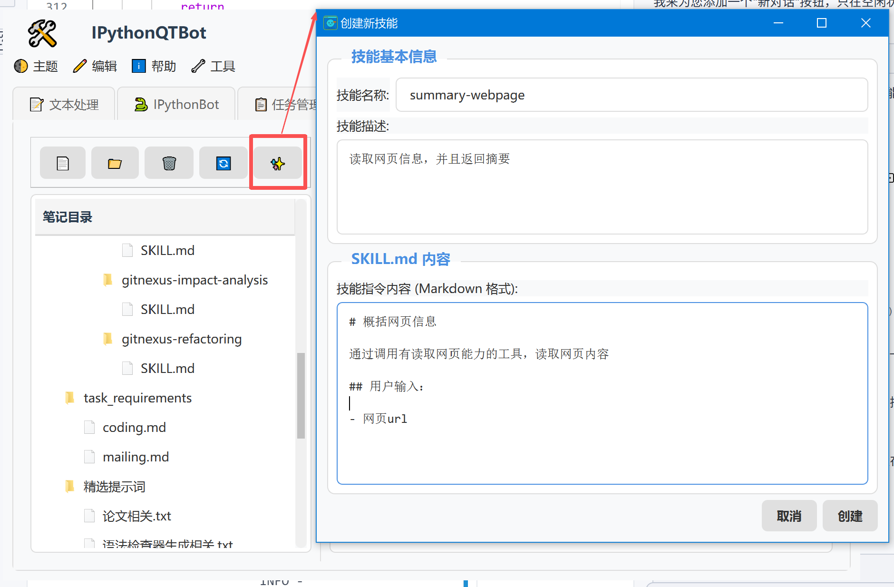
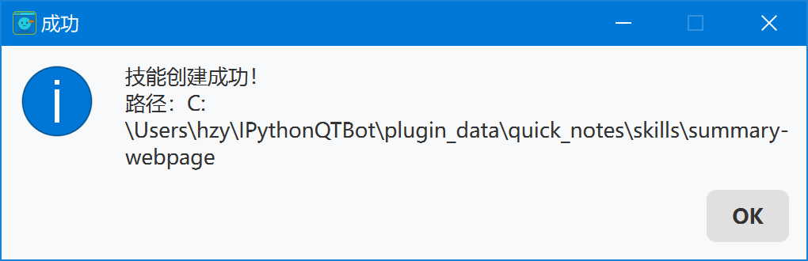
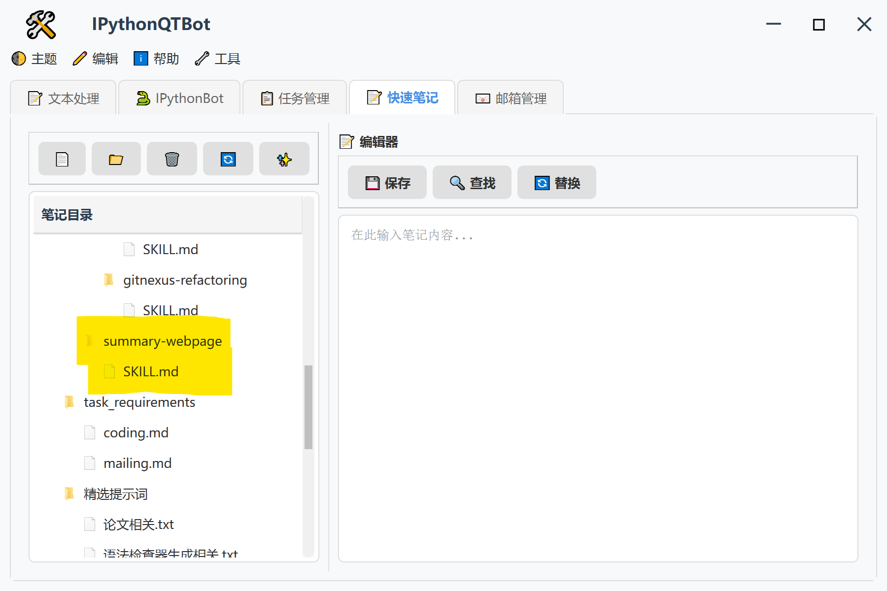

# 技能加载功能 - 快速开始

## 技能存储位置

- 技能存储于：

`~/IPythonQTBot/plugin_data/quick_notes/skills`

遵循标准的SKILLS.md格式。

## 技能创建

- 在“快速笔记”中，点击工具栏上方的“✨”按钮，即可弹出创建新技能的面板。配置后，完成后点击“创建”即可。



- 技能创建成功后，将显示以下对话框，并且左侧显示出技能配置文件：





## 技能使用

## 技能格式解析
````markdown
---
name: [技能名称]
description: [技能描述（尽量1行以内）]
license: MIT
---

# 我的技能

## 何时使用

- 场景 1
- 场景 2

## 如何做

1. 步骤 1
2. 步骤 2

## 示例

```python
# 代码示例
```
````
