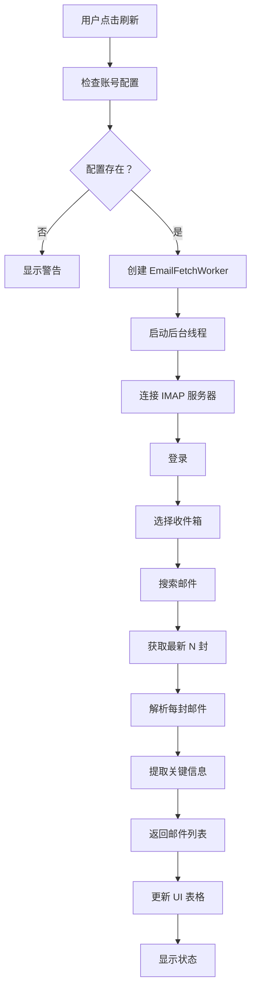
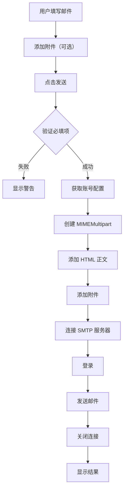

# 📧 邮箱工具插件 - 完整功能总结

## 🎯 核心功能

### 1. 多账号管理
- ✅ 支持配置多个邮箱账号
- ✅ 一键切换不同账号
- ✅ 独立的账号配置界面
- ✅ 安全的密码存储（本地 JSON）

### 2. 邮件收取
- ✅ 后台线程异步获取（不阻塞界面）
- ✅ 显示最近 20 封邮件（可配置）
- ✅ 实时刷新功能
- ✅ 进度条状态提示

### 3. 邮件预览
- ✅ HTML 富文本渲染
- ✅ 超链接支持（可点击打开）
- ✅ 纯文本自动格式化
- ✅ 邮件头信息展示

### 4. 附件管理
- ✅ 附件列表显示
- ✅ 文件大小自动格式化
- ✅ 单附件下载
- ✅ 下载路径选择

### 5. 邮件发送
- ✅ HTML 正文编辑
- ✅ 多收件人支持
- ✅ 多附件添加
- ✅ 附件移除功能
- ✅ 发件人账号选择

### 6. API 集成
- ✅ 6 个导出方法
- ✅ 2 个方法支持 MCP
- ✅ 完整的错误处理
- ✅ 其他插件可调用

## 📁 文件结构

```
plugins/email_utils/
├── __init__.py              # 插件入口导出
├── main.py                  # 主程序逻辑
├── plugin.json              # 插件元数据配置
├── README.md                # 详细使用文档
├── QUICKSTART.md            # 快速开始指南
├── COMPARISON.md            # 与 daily_tasks 对比
├── SUMMARY.md               # 本文件
├── init_data.py             # 初始化脚本
├── test_email_utils.py      # 测试脚本
├── setup.cmd                # Windows 快速设置
├── data/
│   └── email_accounts.json  # 邮箱账号配置
└── ...
```

## 🔧 技术栈

### 前端 UI
- **PySide6** - Qt for Python
  - QWidget, QVBoxLayout, QHBoxLayout
  - QTableWidget, QTextBrowser
  - QDialog, QFormLayout
  - QListWidget, QProgressBar

### 后端处理
- **imaplib** - IMAP 邮件接收（Python 标准库）
- **smtplib** - SMTP 邮件发送（Python 标准库）
- **email** - 邮件解析（Python 标准库）
- **BeautifulSoup4** - HTML 解析

### 并发处理
- **QThread** - 后台线程
- **Signal/Slot** - 线程通信

## 🎨 UI 组件详解

### 主要界面

#### EmailManagerTab（主界面）
```
┌─────────────────────────────────────────┐
│ 邮箱账号：[下拉框] [🔄刷新] [📝写邮件] [⚙️配置] │
├─────────────────────────────────────────┤
│ ID │ 主题 │ 发件人 │ 日期 │ 预览 │ 附件 │
├────┼──────┼───────┼──────┼──────┼──────┤
│    │      │       │      │      │      │
│    │      │       │      │      │      │
│    │      │       │      │      │      │
├─────────────────────────────────────────┤
│ 状态栏                      [进度条]    │
└─────────────────────────────────────────┘
```

#### EmailDetailDialog（邮件详情）
```
┌─────────────────────────────────────┐
│ 邮件详情                            │
├─────────────────────────────────────┤
│ 主题：xxx                           │
│ 发件人：xxx                         │
│ 收件人：xxx                         │
│ 日期：xxx                           │
├─────────────────────────────────────┤
│ 邮件正文（HTML 富文本）               │
│                                     │
├─────────────────────────────────────┤
│ 附件 (2)                            │
│ ┌─────────────────────────────────┐ │
│ │ file1.pdf (1.2 MB)              │ │
│ │ image.png (345 KB)              │ │
│ └─────────────────────────────────┘ │
│           [⬇️ 下载选中附件]          │
└─────────────────────────────────────┘
```

#### SendEmailDialog（写邮件）
```
┌─────────────────────────────────────┐
│ 发送邮件                            │
├─────────────────────────────────────┤
│ 发件人：[下拉框]                    │
│ 收件人：[________________]          │
│ 主  题：[________________]          │
├─────────────────────────────────────┤
│ 正文（支持 HTML）                   │
│ ┌─────────────────────────────────┐ │
│ │ <h1>标题</h1>                   │ │
│ │ <p>内容...</p>                  │ │
│ └─────────────────────────────────┘ │
├─────────────────────────────────────┤
│ 附件                                │
│ ┌─────────────────────────────────┐ │
│ │ file.pdf (1.2 MB)               │ │
│ └─────────────────────────────────┘ │
│ [➕添加] [🗑️移除]                   │
├─────────────────────────────────────┤
│           [确定] [取消]             │
└─────────────────────────────────────┘
```

#### AccountConfigDialog（账号配置）
```
┌─────────────────────────────────────┐
│ 邮箱账号配置                        │
├─────────────────────────────────────┤
│ 已配置的账号                        │
│ ┌─────────────────────────────────┐ │
│ │ QQ 邮箱 (123@qq.com)            │ │
│ │ Gmail (xxx@gmail.com)           │ │
│ └─────────────────────────────────┘ │
│ [➕添加] [✏️编辑] [🗑️删除]          │
├─────────────────────────────────────┤
│           [确定] [取消]             │
└─────────────────────────────────────┘
```

## 🔄 工作流程

### 邮件获取流程



### 邮件发送流程



## 📊 API 详细说明

### 1. get_recent_emails(account_name, limit=20)

**参数：**
- `account_name` (str): 账号名称
- `limit` (int): 数量限制，默认 20

**返回：**
```python
[
    {
        'id': '12345',
        'subject': '邮件主题',
        'from': '发件人 <email@example.com>',
        'date': '2026-03-21 10:30',
        'preview': '正文预览...',
        'has_attachment': True
    }
]
```

### 2. get_email_detail(account_name, email_id)

**参数：**
- `account_name` (str): 账号名称
- `email_id` (str): 邮件 ID

**返回：**
```python
{
    'id': '12345',
    'subject': '邮件主题',
    'from': '发件人 <email@example.com>',
    'to': '收件人 <recipient@example.com>',
    'date': '2026-03-21 10:30',
    'body': '纯文本正文',
    'body_html': '<h1>HTML 正文</h1>',
    'attachments': [
        {
            'filename': 'file.pdf',
            'size': 1234567,
            'content_type': 'application/pdf'
        }
    ]
}
```

### 3. send_email(account_name, to, subject, body, attachments=None)

**参数：**
- `account_name` (str): 账号名称
- `to` (str): 收件人地址（多个用逗号分隔）
- `subject` (str): 邮件主题
- `body` (str): HTML 正文
- `attachments` (list): 附件路径列表（可选）

**返回：**
- `bool`: 是否成功

### 4. get_attachments(account_name, email_id)

**参数：**
- `account_name` (str): 账号名称
- `email_id` (str): 邮件 ID

**返回：**
```python
[
    {
        'filename': 'file.pdf',
        'size': 1234567,
        'content_type': 'application/pdf'
    }
]
```

### 5. download_attachment(account_name, email_id, filename, save_path)

**参数：**
- `account_name` (str): 账号名称
- `email_id` (str): 邮件 ID
- `filename` (str): 附件文件名
- `save_path` (str): 保存路径

**返回：**
- `bool`: 是否成功

### 6. get_accounts()

**参数：** 无

**返回：**
```python
[
    {
        'name': 'QQ 邮箱',
        'username': '123@qq.com',
        'imap_server': 'imap.qq.com',
        ...
        # 不包含 password
    }
]
```

## 🔐 安全特性

### 密码保护
- ✅ 本地 JSON 文件存储
- ✅ 建议使用授权码而非真实密码
- ✅ 不通过网络传输（除了 SSL 加密连接）
- ✅ API 返回时自动移除密码字段

### 连接安全
- ✅ SSL/TLS 加密传输
- ✅ 支持 STARTTLS
- ✅ 证书验证（默认）

### 最佳实践
1. 使用邮箱服务商提供的授权码
2. 定期更新密码/授权码
3. 不要分享配置文件
4. 使用 SSL 加密连接

## 🚀 快速开始

### 步骤 1：安装依赖
```bash
pip install beautifulsoup4
```

### 步骤 2：初始化配置
```bash
cd plugins/email_utils
python init_data.py
```

### 步骤 3：编辑配置
编辑 `data/email_accounts.json`，填入真实的邮箱信息。

### 步骤 4：运行测试
```bash
python test_email_utils.py
```

### 步骤 5：启动主程序
```bash
python run_helper_qt.py
```

## 🎯 使用场景

### 个人使用
- 统一管理多个邮箱
- 快速查看最新邮件
- 批量下载附件

### 工作场景
- 工作邮件自动处理
- 重要邮件提醒
- 附件自动保存

### 开发集成
- 邮件通知功能
- 自动回复系统
- 邮件数据分析

## ⚠️ 注意事项

### 配置相关
1. 首次使用必须配置邮箱账号
2. 确保 IMAP/SMTP 服务已开启
3. 使用正确的授权码
4. 检查服务器地址和端口

### 使用相关
1. 需要网络连接
2. 大附件下载可能需要时间
3. HTML 邮件可能包含外部资源
4. 注意钓鱼邮件风险

### 安全相关
1. 保护好配置文件
2. 定期更新密码
3. 使用 SSL 加密
4. 谨慎处理陌生邮件

## 📖 文档索引

- **README.md** - 完整使用文档
- **QUICKSTART.md** - 快速开始指南
- **COMPARISON.md** - 与 daily_tasks 对比
- **SUMMARY.md** - 本文件

## 🤝 与其他插件对比

详见 [COMPARISON.md](COMPARISON.md)

## 📝 更新日志

### v1.0.0 (2026-03-21)
- ✅ 初始版本发布
- ✅ 多账号管理
- ✅ 邮件收发功能
- ✅ 附件管理
- ✅ API 接口
- ✅ 完整文档

## 🎉 总结

email_utils 是一个功能完整的邮箱管理插件，提供了：

- 📨 多账号统一管理
- 🔄 后台异步邮件获取
- 📄 HTML 富文本预览
- 📎 方便的附件管理
- ✉️ 完整的发送功能
- 🔌 开放的 API 接口

无论是个人使用还是集成到其他应用，都能提供优秀的邮箱管理体验！
